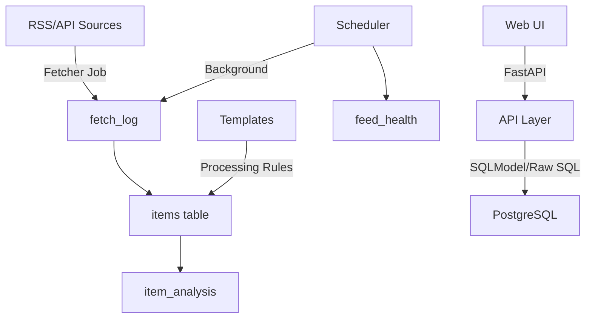

# News-MCP Data Architecture Documentation

## 1. System Overview

The News-MCP system is a news aggregation and processing platform with the following layers:
- **Database Layer**: PostgreSQL with 22 tables
- **Model Layer**: SQLModel/SQLAlchemy hybrid (problematic)
- **API Layer**: FastAPI with 13 API endpoints
- **Frontend Layer**: HTMX-based web components
- **Background Jobs**: Scheduler and Fetcher processes

## 2. Database Schema

### Core Tables (Main Business Logic)

#### 2.1 feeds
**Purpose**: Store RSS/API feed sources
**Current Model**: `/app/models/core.py` - Feed class
**Timestamps**: created_at, updated_at ✅
```
- id (PK)
- url (unique)
- title
- description
- status (enum: active/inactive/error)
- fetch_interval_minutes
- last_fetched
- next_fetch_scheduled
- source_id (FK → sources)
- feed_type_id (FK → feed_types)
- created_at
- updated_at
```

#### 2.2 items
**Purpose**: Store news articles/items
**Current Model**: `/app/models/core.py` - Item class
**Timestamps**: created_at only ⚠️
```
- id (PK)
- title
- link
- description
- content
- author
- published
- guid
- content_hash (unique)
- feed_id (FK → feeds)
- created_at (NO updated_at!)
```

#### 2.3 fetch_log
**Purpose**: Log feed fetching operations
**Current Model**: `/app/models/core.py` - FetchLog class
**Timestamps**: started_at, completed_at (custom) ⚠️
```
- id (PK)
- feed_id (FK → feeds)
- started_at
- completed_at
- status
- items_found
- items_new
- error_message
- response_time_ms
```

### Configuration Tables

#### 2.4 sources
**Purpose**: Define feed sources (RSS, API, Manual)
**Current Model**: `/app/models/feeds.py` - Source class (BaseTableModel) ⚠️
```
- id (PK)
- name
- type (enum)
- created_at
- updated_at
```

#### 2.5 categories
**Purpose**: Categorize feeds
**Current Model**: `/app/models/feeds.py` - Category class (BaseTableModel) ⚠️
```
- id (PK)
- name (unique)
- description
- created_at
- updated_at
```

#### 2.6 feed_types
**Purpose**: Define feed types with default settings
**Current Model**: `/app/models/feeds.py` - FeedType class (BaseTableModel) ⚠️
```
- id (PK)
- name (unique)
- default_interval_minutes
- created_at
- updated_at
```

### Health & Monitoring Tables

#### 2.7 feed_health
**Purpose**: Track feed health metrics
**Current Model**: `/app/models/feeds.py` - FeedHealth class (BaseTableModel) ⚠️
**Problem**: DB has created_at as default, updated_at required
```
- id (PK)
- feed_id (FK → feeds, unique)
- ok_ratio
- consecutive_failures
- avg_response_time_ms
- last_success
- last_failure
- uptime_24h
- uptime_7d
- updated_at
- created_at (default: now())
```

### Processing & Templates Tables

#### 2.8 dynamic_feed_templates
**Purpose**: Store feed processing templates
**Current Model**: `/app/models/processors.py` - DynamicFeedTemplate (BaseTableModel) ⚠️
**Problem**: DB has last_used, usage_count - Model expects different fields
```
- id (PK)
- name (unique)
- description
- version
- url_patterns (JSON)
- field_mappings (JSON)
- content_processing_rules (JSON)
- quality_filters (JSON)
- categorization_rules (JSON)
- fetch_settings (JSON)
- is_active
- is_builtin
- created_by
- created_at
- updated_at
- last_used ⚠️ (in DB but not in some models)
- usage_count ⚠️ (in DB but not in some models)
```

### Analysis Tables (New System)

#### 2.9 item_analysis
**Purpose**: Store AI analysis results for items
```
- id (PK)
- item_id (FK → items)
- analysis_data (JSON)
- created_at
```

#### 2.10 analysis_runs
**Purpose**: Track bulk analysis operations
```
- id (PK)
- started_at
- completed_at
- status
- parameters (JSON)
```

### Junction Tables

#### 2.11 feed_categories
**Purpose**: Many-to-many feeds ↔ categories
```
- feed_id (FK → feeds)
- category_id (FK → categories)
```

#### 2.12 feed_template_assignments
**Purpose**: Assign templates to feeds
```
- id (PK)
- feed_id (FK → feeds)
- template_id (FK → dynamic_feed_templates)
- custom_overrides (JSON)
- is_active
- priority
```

### Problem Table

#### 2.13 basetablemodel ⚠️
**Purpose**: UNKNOWN - appears to be SQLModel artifact
**Status**: Should be investigated/removed

## 3. Model Layer Problems

### Current Issues:
1. **BaseTableModel Inconsistency**
   - Automatically adds created_at + updated_at
   - But many tables don't have both fields
   - Causes SQLModel queries to fail

2. **Multiple Model Definitions**
   - Same table defined in multiple files
   - Different field definitions for same table
   - Old backup files still present

3. **Raw SQL Workarounds**
   - 12+ files using raw SQL instead of SQLModel
   - Inconsistent query patterns
   - No centralized data access layer

## 4. API Layer

### API Endpoints (13 total):
```
/api/feeds/          - Feed CRUD operations
/api/items/          - Item listing and retrieval
/api/categories/     - Category management
/api/sources/        - Source management
/api/processors/     - Processor configuration
/api/statistics/     - System statistics (Raw SQL)
/api/health/         - Health checks
/api/database/       - Database operations
/api/analysis_control/ - Analysis operations
/api/user_settings/  - User preferences
/api/htmx/          - HTMX components (Raw SQL)
```

### Problem Areas:
- htmx endpoints all use Raw SQL
- statistics endpoint uses Raw SQL
- Inconsistent session handling

## 5. Data Flow



## 6. Critical Dependencies

### Who Uses What:
- **22 Python files** import from app.models
- **Fetcher Job**: Uses Raw SQL for items, fetch_log, feed_health
- **Web Components**: All use Raw SQL for HTMX endpoints
- **API Endpoints**: Mixed SQLModel and Raw SQL
- **Scheduler**: Raw SQL for health metrics

## 7. Migration Strategy Requirements

### Must Preserve:
1. **All existing data** in 22 tables
2. **API contracts** - frontend depends on these
3. **Background job functionality** - critical for operations
4. **HTMX component responses** - specific HTML structure needed

### Can Change:
1. Model layer implementation (SQLModel vs SQLAlchemy)
2. Internal query methods
3. Session management patterns
4. Repository/service layer structure

## 8. Recommended Tools

### For Documentation:
1. **dbdiagram.io** - Create visual ERD
2. **SchemaSpy** - Auto-generate HTML documentation
3. **PlantUML** - Code-based diagrams
4. **Alembic** - Migration tracking

### For Development:
1. **SQLAlchemy Core** - More stable than SQLModel
2. **Pydantic** - For validation without ORM coupling
3. **Repository Pattern** - Clean data access layer
4. **pytest** - Test migrations safely

## 9. Risk Assessment

### High Risk Areas:
- ❌ Dynamic feed templates (broken)
- ❌ Content processing logs (disabled)
- ⚠️ Feed health updates (Raw SQL workaround)
- ⚠️ Item insertion (Raw SQL workaround)

### Stable Areas:
- ✅ Basic feed fetching (working with Raw SQL)
- ✅ Items display (working with Raw SQL)
- ✅ Categories/Sources (working with Raw SQL)

## 10. Next Steps

1. **Immediate**: Fix dynamic_feed_templates model
2. **Short-term**: Create repository layer
3. **Medium-term**: Migrate from BaseTableModel
4. **Long-term**: Implement proper migration system

---

*Generated: 2025-09-22*
*Status: System operational but with technical debt*
*Recommendation: Gradual migration to consistent data layer*