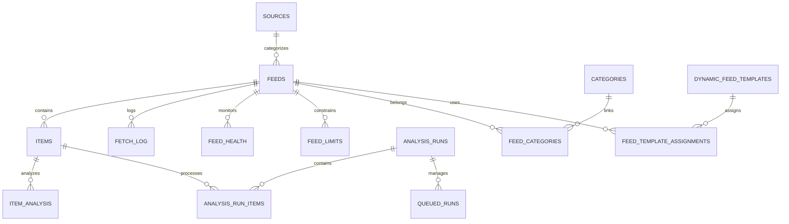

# News MCP Database Schema Documentation

**Enterprise RSS Management & AI Analysis Platform**

Generated: 2025-09-24
Version: v3.0.0-repository-migration

## 📊 Database Overview

| Metric | Value | Description |
|--------|-------|-------------|
| **Database Engine** | PostgreSQL 14+ | Enterprise-grade ACID compliance |
| **Total Tables** | 28 | Normalized schema with foreign key constraints |
| **Total Records** | ~44,650 | Production data volume |
| **Schema Migration** | Alembic | Version-controlled schema changes |
| **Indexes** | 95+ | Optimized for query performance |

## 🏗️ Architecture Overview



---

## 📋 Core Data Models

### 🔄 RSS Feed Management

#### `feeds` - RSS Feed Configuration
**Primary Purpose:** Central feed registry with configuration and status tracking

| Column | Type | Description | Example |
|--------|------|-------------|---------|
| `id` | integer | Unique feed identifier | 1 |
| `url` | varchar | RSS/Atom feed URL | `https://techcrunch.com/feed/` |
| `title` | varchar | Human-readable feed name | "TechCrunch RSS" |
| `status` | enum | Current feed status | `active`, `inactive`, `error` |
| `fetch_interval_minutes` | integer | Fetch frequency | 30 |
| `last_fetched` | timestamp | Last successful fetch time | `2025-09-24 10:30:00` |
| `auto_analyze_enabled` | boolean | Enable automatic AI analysis | `true` |

**Key Relationships:**
- One feed → Many items (`items.feed_id`)
- One feed → Many fetch logs (`fetch_log.feed_id`)
- One feed → One health status (`feed_health.feed_id`)

**Indexes:**
- Primary key on `id`
- Unique index on `url`
- Performance index on `status` + `next_fetch_scheduled`

---

#### `items` - News Articles & Content
**Primary Purpose:** Individual news articles fetched from RSS feeds

| Column | Type | Description | Example |
|--------|------|-------------|---------|
| `id` | integer | Unique article identifier | 12345 |
| `title` | varchar | Article headline | "AI Breakthrough in NLP" |
| `link` | varchar | Original article URL | `https://example.com/article/123` |
| `description` | text | Article summary/excerpt | "Researchers announce..." |
| `content` | text | Full article content | "Full text content..." |
| `author` | varchar | Article author | "Jane Doe" |
| `published` | timestamp | Publication timestamp | `2025-09-24 08:30:00` |
| `guid` | varchar | RSS GUID for deduplication | `https://example.com/guid/123` |
| `content_hash` | varchar | Content fingerprint | `sha256:abc123...` |

**Key Features:**
- **Deduplication:** Uses `content_hash` to prevent duplicate articles
- **Content Extraction:** Supports both RSS description and full content
- **Timeline Indexing:** Optimized for chronological queries

**Performance Indexes:**
- `items_published_idx` - Fast timeline queries
- `items_content_hash_idx` - Duplicate prevention
- `items_feed_timeline_idx` - Feed-specific chronological access

---

### 🧠 AI Analysis System

#### `analysis_runs` - Analysis Job Management
**Primary Purpose:** Track AI analysis jobs from creation to completion

| Column | Type | Description | Example |
|--------|------|-------------|---------|
| `id` | bigint | Unique run identifier | 42 |
| `status` | enum | Current run status | `pending`, `running`, `completed` |
| `scope_json` | jsonb | Analysis scope definition | `{"type": "feed", "params": {"feed_ids": [1,2,3]}}` |
| `params_json` | jsonb | Analysis parameters | `{"model": "gpt-4.1-nano", "type": "comprehensive"}` |
| `queued_count` | integer | Total items queued | 89 |
| `processed_count` | integer | Successfully processed | 85 |
| `failed_count` | integer | Failed to process | 4 |
| `cost_estimate` | decimal | Estimated cost (USD) | 2.45 |
| `actual_cost` | decimal | Final cost (USD) | 2.38 |
| `started_at` | timestamp | Processing start time | `2025-09-24 10:32:15` |
| `completed_at` | timestamp | Processing end time | `2025-09-24 10:35:30` |

**Status Flow:**
```
pending → running → completed
         ↓
       failed/cancelled
```

**Key Metrics:**
- **Processing Rate:** `items_per_min` tracks throughput
- **Cost Tracking:** Both estimated and actual costs in USD
- **Quality Metrics:** Error rates and processing efficiency

---

#### `analysis_run_items` - Individual Processing Tasks
**Primary Purpose:** Granular tracking of each article's analysis process

| Column | Type | Description | Example |
|--------|------|-------------|---------|
| `run_id` | bigint | Parent run identifier | 42 |
| `item_id` | bigint | Article being analyzed | 12345 |
| `state` | enum | Processing state | `queued`, `processing`, `completed`, `failed` |
| `started_at` | timestamp | Processing start time | `2025-09-24 10:33:15` |
| `completed_at` | timestamp | Processing end time | `2025-09-24 10:33:45` |
| `tokens_used` | integer | AI tokens consumed | 850 |
| `cost_usd` | decimal | Processing cost | 0.0127 |
| `error_message` | text | Failure details | `null` |

**Performance Features:**
- **Parallel Processing:** Multiple items processed simultaneously
- **Cost Attribution:** Per-item cost tracking for accurate billing
- **Error Recovery:** Detailed error tracking for debugging

---

#### `item_analysis` - AI Analysis Results
**Primary Purpose:** Store structured AI analysis results for articles

| Column | Type | Description | Structure |
|--------|------|-------------|-----------|
| `item_id` | bigint | Analyzed article | 12345 |
| `sentiment_json` | jsonb | Sentiment analysis | `{"label": "positive", "score": 0.85, "confidence": 0.92}` |
| `impact_json` | jsonb | Impact assessment | `{"overall": 0.7, "business": 0.8, "society": 0.6}` |
| `model_tag` | text | AI model used | "gpt-4.1-nano" |
| `updated_at` | timestamp | Analysis timestamp | `2025-09-24 10:33:45` |

**Analysis Structure Examples:**
```json
{
  "sentiment_json": {
    "label": "positive",
    "score": 0.85,
    "confidence": 0.92,
    "reasoning": "Article discusses breakthrough technology with positive implications"
  },
  "impact_json": {
    "overall": 0.75,
    "business": 0.80,
    "society": 0.70,
    "technology": 0.85,
    "urgency": 0.60,
    "topics": ["AI", "Machine Learning", "Technology"],
    "summary": "Significant technological advancement with broad business applications"
  }
}
```

---

### 🔧 System Management

#### `feed_health` - Feed Monitoring
**Primary Purpose:** Track RSS feed reliability and performance

| Column | Type | Description | Threshold |
|--------|------|-------------|-----------|
| `feed_id` | integer | Monitored feed | 1 |
| `ok_ratio` | float | Success rate (0-1) | >0.95 = healthy |
| `consecutive_failures` | integer | Failed attempts in row | >3 = critical |
| `avg_response_time_ms` | float | Average fetch time | <2000ms = good |
| `uptime_24h` | float | 24-hour availability | >0.99 = excellent |
| `uptime_7d` | float | 7-day availability | >0.95 = healthy |
| `last_success` | timestamp | Last successful fetch | Recent |
| `last_failure` | timestamp | Last failed fetch | `null` if healthy |

**Health Status Calculation:**
```sql
CASE
  WHEN consecutive_failures >= 5 THEN 'critical'
  WHEN ok_ratio < 0.90 THEN 'warning'
  WHEN avg_response_time_ms > 5000 THEN 'slow'
  ELSE 'healthy'
END as health_status
```

---

#### `fetch_log` - Feed Fetch History
**Primary Purpose:** Audit trail for all RSS feed fetch operations

| Column | Type | Description | Example |
|--------|------|-------------|---------|
| `feed_id` | integer | Source feed | 1 |
| `started_at` | timestamp | Fetch start time | `2025-09-24 10:30:00` |
| `completed_at` | timestamp | Fetch end time | `2025-09-24 10:30:02` |
| `status` | varchar | Fetch result | `success`, `error`, `empty` |
| `items_found` | integer | Items in feed | 12 |
| `items_new` | integer | New items added | 8 |
| `error_message` | text | Failure details | `null` |
| `response_time_ms` | integer | Network latency | 1250 |

**Data Volume:** ~28,684 records (historical fetch data)

---

#### `feed_limits` - Analysis Controls
**Primary Purpose:** Control and limit AI analysis costs per feed

| Column | Type | Description | Example |
|--------|------|-------------|---------|
| `feed_id` | integer | Controlled feed | 1 |
| `max_analyses_per_day` | integer | Daily analysis limit | 100 |
| `daily_cost_limit` | float | Daily spend limit (USD) | 5.00 |
| `monthly_cost_limit` | float | Monthly spend limit (USD) | 150.00 |
| `cost_alert_threshold` | float | Alert threshold (USD) | 4.00 |
| `emergency_stop_enabled` | boolean | Auto-stop on breach | `true` |
| `auto_disable_on_cost_breach` | boolean | Auto-disable feed | `true` |
| `violations_count` | integer | Limit breach count | 0 |

**Safety Features:**
- **Cost Controls:** Multiple spend limits to prevent overruns
- **Emergency Stop:** Automatic halting on threshold breach
- **Violation Tracking:** Audit trail of limit breaches

---

### 🎨 Content Processing

#### `dynamic_feed_templates` - Content Extraction Rules
**Primary Purpose:** Define how to parse different RSS feed formats

| Column | Type | Description | Example |
|--------|------|-------------|---------|
| `name` | varchar | Template identifier | "TechCrunch RSS" |
| `url_patterns` | varchar | Matching URL patterns | `techcrunch.com/feed` |
| `field_mappings` | text | Content extraction rules | `{"title": "title", "content": "description"}` |
| `content_processing_rules` | text | Content cleanup rules | `{"remove_ads": true, "clean_html": true}` |
| `is_active` | boolean | Template enabled | `true` |
| `is_builtin` | boolean | System template | `true` |
| `usage_count` | integer | Times used | 1250 |

**Template Structure Example:**
```json
{
  "field_mappings": {
    "title": "title",
    "content": "description",
    "author": "dc:creator",
    "published": "pubDate",
    "image": "media:content[medium='image']/@url"
  },
  "content_processing_rules": {
    "remove_html": true,
    "trim_whitespace": true,
    "extract_images": true,
    "clean_links": true
  },
  "quality_filters": {
    "min_content_length": 100,
    "require_title": true,
    "block_patterns": ["advertisement", "sponsored"]
  }
}
```

---

## 🔗 Relationship Mapping

### Core Entity Relationships

```sql
-- Feed to Items (One-to-Many)
feeds.id → items.feed_id

-- Items to Analysis (One-to-One)
items.id → item_analysis.item_id

-- Analysis Runs to Items (Many-to-Many via junction)
analysis_runs.id → analysis_run_items.run_id
items.id → analysis_run_items.item_id

-- Feeds to Health Monitoring (One-to-One)
feeds.id → feed_health.feed_id

-- Feeds to Processing Logs (One-to-Many)
feeds.id → fetch_log.feed_id

-- Feeds to Categories (Many-to-Many via junction)
feeds.id → feed_categories.feed_id
categories.id → feed_categories.category_id

-- Sources to Feeds (One-to-Many)
sources.id → feeds.source_id

-- Templates to Feed Assignments (One-to-Many)
dynamic_feed_templates.id → feed_template_assignments.template_id
feeds.id → feed_template_assignments.feed_id
```

---

## 📈 Performance Optimization

### Critical Indexes

#### Feed Operations
```sql
-- Fast feed listing by status
CREATE INDEX idx_feeds_status_next_fetch
ON feeds (status, next_fetch_scheduled);

-- Feed URL uniqueness
CREATE UNIQUE INDEX idx_feeds_url ON feeds (url);
```

#### Article Queries
```sql
-- Timeline queries (most common)
CREATE INDEX items_published_idx ON items (published DESC);

-- Feed-specific timelines
CREATE INDEX items_feed_timeline_idx
ON items (feed_id, published DESC);

-- Duplicate detection
CREATE UNIQUE INDEX items_content_hash_idx
ON items (content_hash);
```

#### Analysis Performance
```sql
-- Analysis run status queries
CREATE INDEX idx_analysis_runs_status ON analysis_runs (status);

-- Run item processing queries
CREATE INDEX idx_run_items_run_id_state
ON analysis_run_items (run_id, state);

-- Analysis lookup by item
CREATE INDEX item_analysis_item_id_idx
ON item_analysis (item_id);
```

### Query Optimization Examples

#### Most Common Queries

**1. Recent Articles with Analysis:**
```sql
SELECT i.*, ia.sentiment_json, ia.impact_json
FROM items i
LEFT JOIN item_analysis ia ON i.id = ia.item_id
WHERE i.published > NOW() - INTERVAL '24 hours'
ORDER BY i.published DESC
LIMIT 50;
```

**2. Feed Health Dashboard:**
```sql
SELECT f.title, fh.ok_ratio, fh.consecutive_failures,
       fh.avg_response_time_ms, fh.uptime_24h
FROM feeds f
JOIN feed_health fh ON f.id = fh.feed_id
WHERE f.status = 'active'
ORDER BY fh.ok_ratio DESC;
```

**3. Analysis Cost Tracking:**
```sql
SELECT ar.id, ar.status,
       ar.queued_count, ar.processed_count, ar.failed_count,
       ar.cost_estimate, ar.actual_cost,
       EXTRACT(EPOCH FROM (ar.completed_at - ar.started_at))/60 as duration_minutes
FROM analysis_runs ar
WHERE ar.created_at > NOW() - INTERVAL '7 days'
ORDER BY ar.created_at DESC;
```

---

## 🔄 Data Migration & Versioning

### Alembic Migration System

**Current Schema Version:** Latest applied migration
**Migration Directory:** `/alembic/versions/`
**Migration Naming:** `{revision}_{description}.py`

### Common Migration Operations

#### Adding New Features
```python
# Example: Adding AI model tracking
def upgrade():
    op.add_column('item_analysis',
        sa.Column('model_version', sa.String(50), nullable=True))
    op.create_index('idx_item_analysis_model',
        'item_analysis', ['model_version'])
```

#### Performance Improvements
```python
# Example: Adding composite index
def upgrade():
    op.create_index('idx_items_feed_published_analyzed',
        'items', ['feed_id', 'published', 'has_analysis'])
```

#### Schema Evolution
```python
# Example: Normalizing JSON data
def upgrade():
    # Create new normalized table
    op.create_table('analysis_topics',
        sa.Column('id', sa.BigInteger, primary_key=True),
        sa.Column('item_analysis_id', sa.BigInteger,
                  sa.ForeignKey('item_analysis.item_id')),
        sa.Column('topic', sa.String(100), nullable=False),
        sa.Column('confidence', sa.Float, nullable=False)
    )
```

---

## 📊 Data Volume & Growth Patterns

### Current Data Volume (Production)
| Table | Records | Growth Rate | Storage Impact |
|-------|---------|-------------|----------------|
| `items` | ~7,177 | +100-200/day | High (content storage) |
| `fetch_log` | ~28,684 | +1,000/day | Medium (structured data) |
| `analysis_run_items` | ~2,761 | +50-100/day | Low (metadata only) |
| `item_analysis` | ~2,674 | +30-80/day | Medium (JSON storage) |

### Projected Growth (6 months)
- **Items:** ~25,000 articles (+250% growth)
- **Analysis Data:** ~8,000 analyzed articles (+200% growth)
- **Storage Requirements:** ~2GB database size
- **Index Maintenance:** Weekly VACUUM and REINDEX recommended

---

## 🔒 Data Integrity & Constraints

### Foreign Key Constraints
```sql
-- Ensure referential integrity
ALTER TABLE items
ADD CONSTRAINT fk_items_feed
FOREIGN KEY (feed_id) REFERENCES feeds(id) ON DELETE CASCADE;

ALTER TABLE analysis_run_items
ADD CONSTRAINT fk_run_items_run
FOREIGN KEY (run_id) REFERENCES analysis_runs(id) ON DELETE CASCADE;

ALTER TABLE item_analysis
ADD CONSTRAINT fk_analysis_item
FOREIGN KEY (item_id) REFERENCES items(id) ON DELETE CASCADE;
```

### Data Validation Rules
```sql
-- Ensure positive costs
ALTER TABLE analysis_runs
ADD CONSTRAINT chk_positive_cost
CHECK (actual_cost >= 0);

-- Ensure valid timestamps
ALTER TABLE analysis_runs
ADD CONSTRAINT chk_valid_timerange
CHECK (completed_at IS NULL OR completed_at >= started_at);

-- Ensure valid success ratios
ALTER TABLE feed_health
ADD CONSTRAINT chk_valid_ratio
CHECK (ok_ratio >= 0 AND ok_ratio <= 1);
```

---

## 🛠️ Database Maintenance

### Regular Maintenance Tasks

#### Daily
- Monitor slow queries via `pg_stat_statements`
- Check disk space and growth trends
- Verify backup completion

#### Weekly
- Run `VACUUM ANALYZE` on high-traffic tables
- Review and optimize slow queries
- Check index usage statistics

#### Monthly
- Full database backup verification
- Review and purge old logs (>90 days)
- Update table statistics
- Schema migration planning

### Monitoring Queries

**Check Table Sizes:**
```sql
SELECT schemaname, tablename,
       pg_size_pretty(pg_total_relation_size(schemaname||'.'||tablename)) as size
FROM pg_tables
WHERE schemaname = 'public'
ORDER BY pg_total_relation_size(schemaname||'.'||tablename) DESC;
```

**Find Unused Indexes:**
```sql
SELECT schemaname, tablename, indexname, idx_tup_read, idx_tup_fetch
FROM pg_stat_user_indexes
WHERE idx_tup_read = 0 AND idx_tup_fetch = 0
ORDER BY schemaname, tablename;
```

**Monitor Query Performance:**
```sql
SELECT query, calls, total_time, mean_time,
       stddev_time, rows, 100.0 * shared_blks_hit /
       NULLIF(shared_blks_hit + shared_blks_read, 0) AS hit_percent
FROM pg_stat_statements
WHERE calls > 100
ORDER BY total_time DESC
LIMIT 10;
```

---

## 📚 Additional Resources

- **PostgreSQL Documentation**: [PostgreSQL 14 Docs](https://www.postgresql.org/docs/14/)
- **Alembic Migration Guide**: [Alembic Documentation](https://alembic.sqlalchemy.org/)
- **Performance Tuning**: [PostgreSQL Performance](https://wiki.postgresql.org/wiki/Performance_Optimization)
- **SQLAlchemy Models**: `/app/models/` directory
- **Migration Scripts**: `/alembic/versions/` directory

---

**Last Updated**: 2025-09-24
**Database Version**: PostgreSQL 14+
**Schema Version**: v3.0.0-repository-migration
**Documentation Version**: 1.0