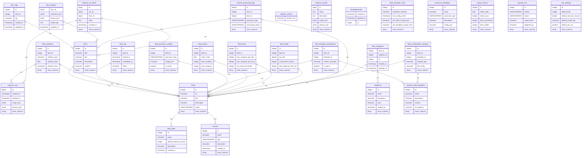

# Entity Relationship Diagram (Mermaid)

Generated: 2025-09-23 21:12:50

```mermaid
erDiagram
    analysis_run_items ||--o{ items : has
    analysis_run_items ||--o{ analysis_runs : has
    content_processing_logs ||--o{ feeds : has
    content_processing_logs ||--o{ items : has
    feed_categories ||--o{ categories : has
    feed_categories ||--o{ feeds : has
    feed_configuration_changes ||--o{ feeds : has
    feed_configuration_changes ||--o{ dynamic_feed_templates : has
    feed_health ||--o{ feeds : has
    feed_limits ||--o{ feeds : has
    feed_metrics ||--o{ feeds : has
    feed_processor_configs ||--o{ feeds : has
    feed_template_assignments ||--o{ feeds : has
    feed_template_assignments ||--o{ dynamic_feed_templates : has
    feed_violations ||--o{ analysis_runs : has
    feed_violations ||--o{ feeds : has
    feeds ||--o{ feed_types : has
    feeds ||--o{ sources : has
    fetch_log ||--o{ feeds : has
    item_analysis ||--o{ items : has
    item_tags ||--o{ items : has
    items ||--o{ feeds : has

    alembic_version {
        character version_num
    }

    analysis_presets {
        bigint id
        text name
        text description
        jsonb scope_json
        jsonb params_json
        string more_columns
    }

    analysis_run_items {
        bigint id
        bigint run_id
        bigint item_id
        text state
        timestamp created_at
        string more_columns
    }

    analysis_runs {
        bigint id
        timestamp created_at
        timestamp updated_at
        jsonb scope_json
        jsonb params_json
        string more_columns
    }

    basetablemodel {
        timestamp created_at
        timestamp updated_at
        integer id
    }

    categories {
        integer id
        character name
        character description
        character color
        timestamp created_at
        string more_columns
    }

    content_processing_logs {
        integer id
        integer item_id
        integer feed_id
        USER-DEFINED processor_type
        USER-DEFINED processing_status
        string more_columns
    }

    dynamic_feed_templates {
        integer id
        character name
        character description
        character version
        character url_patterns
        string more_columns
    }

    feed_categories {
        integer feed_id
        integer category_id
        integer id
        timestamp created_at
        timestamp updated_at
    }

    feed_configuration_changes {
        integer id
        integer feed_id
        integer template_id
        character change_type
        character old_config
        string more_columns
    }

    feed_health {
        integer id
        integer feed_id
        double ok_ratio
        integer consecutive_failures
        double avg_response_time_ms
        string more_columns
    }

    feed_limits {
        integer id
        integer feed_id
        integer max_analyses_per_day
        integer max_analyses_per_hour
        integer min_interval_minutes
        string more_columns
    }

    feed_metrics {
        integer id
        integer feed_id
        date metric_date
        integer total_analyses
        integer auto_analyses
        string more_columns
    }

    feed_processor_configs {
        integer id
        integer feed_id
        USER-DEFINED processor_type
        character config_json
        boolean is_active
        string more_columns
    }

    feed_scheduler_state {
        integer id
        character scheduler_instance
        timestamp last_config_check
        character last_feed_config_hash
        character last_template_config_hash
        string more_columns
    }

    feed_template_assignments {
        integer id
        integer feed_id
        integer template_id
        character custom_overrides
        boolean is_active
        string more_columns
    }

    feed_types {
        integer id
        character name
        integer default_interval_minutes
        character description
        timestamp created_at
    }

    feed_violations {
        integer id
        integer feed_id
        character violation_type
        date violation_date
        timestamp violation_time
        string more_columns
    }

    feeds {
        integer id
        character url
        character title
        character description
        USER-DEFINED status
        string more_columns
    }

    fetch_log {
        integer id
        integer feed_id
        timestamp started_at
        timestamp completed_at
        character status
        string more_columns
    }

    item_analysis {
        bigint item_id
        jsonb sentiment_json
        jsonb impact_json
        text model_tag
        timestamp updated_at
    }

    item_tags {
        integer id
        integer item_id
        character tag
        timestamp created_at
        timestamp updated_at
    }

    items {
        integer id
        character title
        character link
        character description
        character content
        string more_columns
    }

    processor_templates {
        integer id
        character name
        USER-DEFINED processor_type
        character description
        character config_json
        string more_columns
    }

    queue_metrics {
        integer id
        date metric_date
        integer metric_hour
        integer items_processed
        integer items_failed
        string more_columns
    }

    queued_runs {
        integer id
        USER-DEFINED priority
        USER-DEFINED status
        character scope_hash
        character triggered_by
        string more_columns
    }

    sources {
        integer id
        character name
        USER-DEFINED type
        character description
        timestamp created_at
        string more_columns
    }

    user_settings {
        integer id
        integer default_limit
        double default_rate_per_second
        character default_model_tag
        boolean default_dry_run
        string more_columns
    }

```
