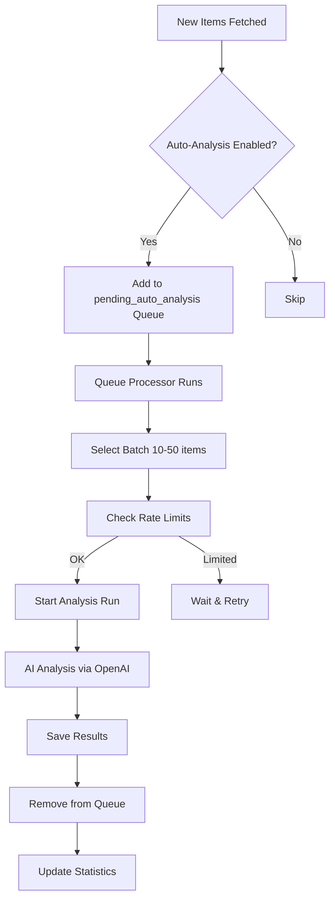

# Auto-Analysis Dashboard - Automatic AI Analysis System

The **Auto-Analysis Dashboard** provides complete control and monitoring of the **automatic AI analysis system** for RSS feeds (Phase 2 feature).

**URL:** `http://localhost:8000/admin/auto-analysis`

---

## 🤖 Overview

Auto-Analysis automatically processes new feed items with AI-powered sentiment analysis as they arrive, eliminating the need for manual analysis runs.

### What is Auto-Analysis?

**Traditional Workflow (Manual):**
```
New Items → Database → Manual Selection → Analysis Cockpit → AI Analysis
```

**Auto-Analysis Workflow:**
```
New Items → Database → Auto Trigger → Queue → Automatic AI Analysis ✨
```

### Key Benefits

- ✅ **Zero Manual Intervention** - Analysis happens automatically
- ✅ **Real-time Processing** - New items analyzed within minutes
- ✅ **Configurable Per Feed** - Enable only for important feeds
- ✅ **Queue Management** - Intelligent batching and rate limiting
- ✅ **Cost Control** - Daily limits and monitoring

---

## 🚀 Quick Start

### Enable Auto-Analysis for a Feed

**Method 1: Via Dashboard**

1. Navigate to `http://localhost:8000/admin/auto-analysis`
2. Find your feed in the feed list
3. Click the **"Enable Auto-Analysis"** toggle
4. Confirm the action
5. ✅ Done! New items will be auto-analyzed

**Method 2: Via API**

```bash
curl -X POST http://localhost:8000/api/feeds/1/toggle-auto-analysis?enabled=true
```

**Method 3: Via MCP Tool (Claude Desktop)**

```
You: "Enable auto-analysis for feed #1"
Claude: *uses update_feed tool*
```

---

## 📊 Dashboard Sections

### 1. Feed Configuration Panel

Control which feeds have auto-analysis enabled.

#### Feed List

**Displayed Information:**

| Column | Description | Example |
|--------|-------------|---------|
| **Feed ID** | Unique identifier | #1 |
| **Feed Name** | RSS feed title | TechCrunch |
| **Status** | Feed active/inactive | ✅ Active |
| **Auto-Analysis** | Enabled/Disabled toggle | 🟢 Enabled |
| **Items Today** | New items fetched today | 15 items |
| **Pending** | Items in queue | 3 items |
| **Last Run** | Last auto-analysis time | 5 min ago |

#### Toggle Auto-Analysis

**Enable:**
```
┌─────────────────────────────────────────┐
│ Feed: TechCrunch (#1)                   │
│ Status: 🔴 Disabled                     │
│                                         │
│ [Enable Auto-Analysis] ← Click here    │
└─────────────────────────────────────────┘
```

**After Enabling:**
```
┌─────────────────────────────────────────┐
│ Feed: TechCrunch (#1)                   │
│ Status: 🟢 Enabled                      │
│                                         │
│ [Disable Auto-Analysis]                 │
│                                         │
│ Queue: 15 items pending                 │
│ Last run: Just now                      │
└─────────────────────────────────────────┘
```

---

### 2. Queue Status Panel

Real-time view of pending auto-analysis items.

#### Queue Metrics

```
┌─ Queue Overview ─────────────────────────┐
│ Total Pending:        42 items           │
│ Feeds with Queue:     5 feeds            │
│ Oldest Item:          12 minutes ago     │
│ Est. Processing Time: 14 seconds         │
└──────────────────────────────────────────┘
```

#### Queue by Feed

**Table View:**

| Feed | Pending Items | Oldest Item | Status |
|------|---------------|-------------|--------|
| TechCrunch | 15 items | 5 min ago | Processing |
| The Verge | 12 items | 8 min ago | Queued |
| Ars Technica | 8 items | 12 min ago | Queued |
| Wired | 5 items | 3 min ago | Processing |
| Engadget | 2 items | 1 min ago | Queued |

#### Queue Actions

- **Process Now** - Manually trigger queue processing
- **Clear Queue** - Remove all pending items (confirmation required)
- **View Details** - See specific items in queue

---

### 3. Active Runs Monitor

Track currently running auto-analysis runs.

**Active Run Display:**

```
┌─ Active Runs ────────────────────────────────────────────┐
│ Run #156 | TechCrunch                                    │
│ Progress: ▓▓▓▓▓▓░░░░ 60% (9/15 items)                   │
│ Speed: 2.8 items/sec | ETA: 3 seconds                    │
│                                                           │
│ Run #157 | The Verge                                     │
│ Progress: ▓░░░░░░░░░ 8% (1/12 items)                    │
│ Speed: 3.1 items/sec | ETA: 4 seconds                    │
└───────────────────────────────────────────────────────────┘
```

**Run Status Indicators:**

- 🔵 **Running** - Currently processing items
- 🟡 **Queued** - Waiting for worker availability
- 🟢 **Completed** - Successfully finished
- 🔴 **Failed** - Error occurred
- ⚫ **Rate Limited** - Waiting for rate limit reset

---

### 4. Statistics Panel

Historical auto-analysis performance metrics.

#### Today's Statistics

```
┌─ Today's Auto-Analysis ──────────────────────┐
│ Runs Completed:      18 runs                 │
│ Items Analyzed:      247 items               │
│ Success Rate:        98.8% (244/247)         │
│ Average Duration:    8.2 seconds/run         │
│ Total Cost:          $1.23                   │
│ Remaining Budget:    498 runs left today     │
└──────────────────────────────────────────────┘
```

#### Weekly Trend

**Chart Display:**
```
Items Analyzed (Last 7 Days)
────────────────────────────────────
Mon |████████████████ 120
Tue |██████████████████ 145
Wed |███████████████ 110
Thu |████████████████████ 168
Fri |██████████████ 95
Sat |████████ 65
Sun |███████████████████ 155
────────────────────────────────────
```

#### Top Performing Feeds

| Feed | Items | Success Rate | Avg Time |
|------|-------|--------------|----------|
| TechCrunch | 85 | 100% | 6.2s |
| The Verge | 72 | 98.6% | 7.8s |
| Wired | 54 | 100% | 5.9s |
| Ars Technica | 36 | 97.2% | 8.1s |

---

### 5. History Timeline

Recent auto-analysis run history with results.

**Timeline View:**

```
┌─ Recent Auto-Analysis Runs ──────────────────────────────┐
│ 5 min ago  | Run #156 | TechCrunch    | 15 items | ✅   │
│ 12 min ago | Run #155 | The Verge     | 12 items | ✅   │
│ 18 min ago | Run #154 | Wired         | 8 items  | ✅   │
│ 25 min ago | Run #153 | TechCrunch    | 10 items | ✅   │
│ 32 min ago | Run #152 | Engadget      | 5 items  | ❌   │
│ 45 min ago | Run #151 | Ars Technica  | 18 items | ✅   │
└───────────────────────────────────────────────────────────┘
```

**Details on Click:**
```
Run #156 - TechCrunch (Completed)
─────────────────────────────────────────
Started: 2025-10-01 10:05:00
Completed: 2025-10-01 10:05:17
Duration: 17 seconds
Items: 15/15 processed
Success: 100%
Cost: $0.08
Errors: None

Items Analyzed:
1. "Apple announces new MacBook Pro..."
2. "Tesla expands Supercharger network..."
[... 13 more items]
─────────────────────────────────────────
```

---

## ⚙️ Configuration

### Environment Variables

Auto-analysis is controlled by `.env` settings:

```bash
# Auto-Analysis Configuration
MAX_DAILY_AUTO_RUNS=500          # Max auto-analysis runs per day
AUTO_ANALYSIS_RATE_PER_SECOND=3.0  # OpenAI API rate limit
MAX_CONCURRENT_RUNS=5             # Parallel auto-analysis runs
MAX_HOURLY_RUNS=50                # Hourly run limit (all types)

# General Analysis Settings
OPENAI_API_KEY=sk-...            # Required for AI analysis
MAX_DAILY_RUNS=100               # Manual analysis limit
```

### Feed-Level Settings

Each feed can be configured independently:

**Database Fields:**
```sql
-- feeds table
auto_analysis_enabled   BOOLEAN DEFAULT FALSE
auto_analysis_interval  INTEGER DEFAULT 60    -- minutes
```

**API Configuration:**
```json
{
  "feed_id": 1,
  "auto_analysis_enabled": true,
  "auto_analysis_interval": 60
}
```

---

## 🔄 How Auto-Analysis Works

### Workflow



### Trigger Conditions

**Auto-analysis is triggered when:**

1. ✅ Feed has `auto_analysis_enabled = true`
2. ✅ New items fetched successfully
3. ✅ Items not already analyzed
4. ✅ Daily limit not exceeded (`MAX_DAILY_AUTO_RUNS`)
5. ✅ Concurrent run limit not exceeded (`MAX_CONCURRENT_RUNS`)

### Queue Processing

**Batch Processing:**
- Batch size: 10-50 items (configurable)
- Priority: Oldest items first (FIFO)
- Rate limiting: 3.0 req/sec to OpenAI

**Processor Schedule:**
```
Every 5 minutes:
  1. Check pending_auto_analysis table
  2. Group items by feed
  3. Create batches (10-50 items)
  4. Submit to analysis queue
  5. Monitor progress
```

### Error Handling

**Automatic Retries:**
- **Network errors** - Retry up to 3 times
- **Rate limit errors** - Exponential backoff (1s, 2s, 4s)
- **API errors** - Log and skip item
- **Permanent failures** - Mark as failed, alert admin

**Failure Actions:**
1. Log error details
2. Update run status to "failed"
3. Notify via webhook (if configured)
4. Items remain in queue for retry
5. Admin alert if >10% failure rate

---

## 📊 Monitoring & Alerts

### Key Metrics to Watch

**Queue Depth:**
- Normal: <50 items
- Warning: 50-200 items
- Critical: >200 items (indicates processing backlog)

**Success Rate:**
- Healthy: >95%
- Warning: 90-95%
- Critical: <90%

**Processing Time:**
- Normal: <10 seconds/run
- Warning: 10-30 seconds
- Critical: >30 seconds (rate limiting or API issues)

### Dashboard Alerts

**Queue Backlog Alert:**
```
⚠️  Queue Backlog Warning
────────────────────────────────────
Current queue depth: 245 items
Expected processing time: 82 seconds
Recommendation: Increase MAX_CONCURRENT_RUNS
or reduce AUTO_ANALYSIS_RATE_PER_SECOND
```

**Daily Limit Warning:**
```
⚠️  Daily Limit Approaching
────────────────────────────────────
Auto-analysis runs today: 480/500
Remaining: 20 runs (4% left)
Time until reset: 6 hours
Recommendation: Prioritize important feeds
```

**Failure Rate Alert:**
```
🔴 High Failure Rate Detected
────────────────────────────────────
Success rate (last hour): 78%
Failed runs: 11/50
Common error: OpenAI API rate limit
Recommendation: Check OPENAI_API_KEY and rate limits
```

---

## 🎯 Use Cases

### 1. Real-time News Monitoring

**Scenario:** Monitor breaking tech news automatically

**Setup:**
1. Enable auto-analysis for: TechCrunch, The Verge, Wired
2. Set fetch interval: 15 minutes
3. Configure Slack webhook for sentiment alerts
4. Monitor queue for backlog

**Result:** Breaking news analyzed within 15-20 minutes of publication

### 2. Sentiment Trend Analysis

**Scenario:** Track sentiment trends for specific topics

**Setup:**
1. Enable auto-analysis for industry-specific feeds
2. Configure category grouping
3. Export daily sentiment reports
4. Build trend dashboard

**Result:** Automated daily sentiment reports without manual intervention

### 3. Cost-Optimized Analysis

**Scenario:** Minimize OpenAI costs while maintaining coverage

**Setup:**
1. Enable auto-analysis only for high-priority feeds (5-10 feeds)
2. Set MAX_DAILY_AUTO_RUNS=200 (lower limit)
3. Use manual analysis for ad-hoc needs
4. Monitor cost in statistics panel

**Result:** ~$2-3/day OpenAI costs vs ~$10+/day with all feeds enabled

---

## 🐛 Troubleshooting

### Issue: Queue growing, items not processed

**Possible Causes:**
- Worker not running
- Rate limits too restrictive
- OpenAI API key invalid
- Database connection issues

**Solutions:**
```bash
# 1. Check worker status
./scripts/status.sh

# 2. View worker logs
tail -f logs/analysis-worker.log

# 3. Restart worker
./scripts/start-worker.sh

# 4. Check queue manually
curl http://localhost:8000/api/auto-analysis/queue

# 5. Process queue manually via Manager
# Visit: http://localhost:8000/admin/manager
# Click: "Process Queue Now"
```

### Issue: High failure rate

**Possible Causes:**
- OpenAI API rate limits exceeded
- Invalid API key
- Network issues
- Malformed feed items

**Solutions:**
1. Check OpenAI API status: https://status.openai.com
2. Verify API key: `echo $OPENAI_API_KEY`
3. Reduce rate: `AUTO_ANALYSIS_RATE_PER_SECOND=2.0`
4. Check error logs for specific items

### Issue: Auto-analysis not triggering

**Possible Causes:**
- Feed has `auto_analysis_enabled = false`
- No new items fetched
- Daily limit reached
- Feed fetch failing

**Solutions:**
```sql
-- 1. Check feed config
SELECT id, title, auto_analysis_enabled, status
FROM feeds
WHERE id = 1;

-- 2. Check recent items
SELECT COUNT(*) as new_items
FROM items
WHERE feed_id = 1
AND published > NOW() - INTERVAL '1 day';

-- 3. Check fetch log
SELECT * FROM fetch_log
WHERE feed_id = 1
ORDER BY started_at DESC
LIMIT 5;
```

### Issue: Daily limit reached too early

**Cause:** Too many enabled feeds or high fetch frequency

**Solutions:**
```bash
# Option 1: Increase daily limit (costs more)
MAX_DAILY_AUTO_RUNS=1000

# Option 2: Disable auto-analysis for low-priority feeds
# Via dashboard: toggle off less important feeds

# Option 3: Reduce fetch frequency
# Edit feed: set fetch_interval_minutes = 60 (instead of 15)
```

---

## 📈 Performance Optimization

### Recommended Settings

**Small Setup (1-10 feeds):**
```bash
MAX_CONCURRENT_RUNS=2
AUTO_ANALYSIS_RATE_PER_SECOND=1.0
MAX_DAILY_AUTO_RUNS=200
```

**Medium Setup (10-30 feeds):**
```bash
MAX_CONCURRENT_RUNS=5
AUTO_ANALYSIS_RATE_PER_SECOND=3.0
MAX_DAILY_AUTO_RUNS=500
```

**Large Setup (30+ feeds):**
```bash
MAX_CONCURRENT_RUNS=10
AUTO_ANALYSIS_RATE_PER_SECOND=5.0
MAX_DAILY_AUTO_RUNS=1000
```

### Cost Estimation

**Average Costs:**
- **Per item analyzed:** ~$0.005
- **Per run (50 items):** ~$0.25
- **Daily (500 runs, 100 items/run):** ~$25
- **Monthly (30 days):** ~$750

**Optimization Tips:**
1. Enable auto-analysis only for important feeds
2. Use scope limits to batch items efficiently
3. Skip already-analyzed items
4. Monitor costs in statistics panel

---

## 🔗 Related Pages

- **[Analysis Cockpit v4](Analysis-Cockpit)** - Manual analysis interface
- **[Manager Control Center](Manager-Control-Center)** - System controls & emergency stop
- **[Dashboard Overview](Dashboard-Overview)** - All dashboards
- **[Auto-Analysis API](API-Auto-Analysis)** - Programmatic access
- **[Troubleshooting](Troubleshooting-Common)** - General issues

---

**Template File:** `templates/auto_analysis.html`
**Service:** `app/services/auto_analysis_service.py`
**Processor:** `app/services/pending_analysis_processor.py`
**Last Updated:** 2025-10-01
**Status:** ✅ Production (100% Rollout)
